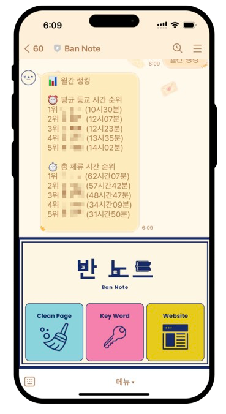
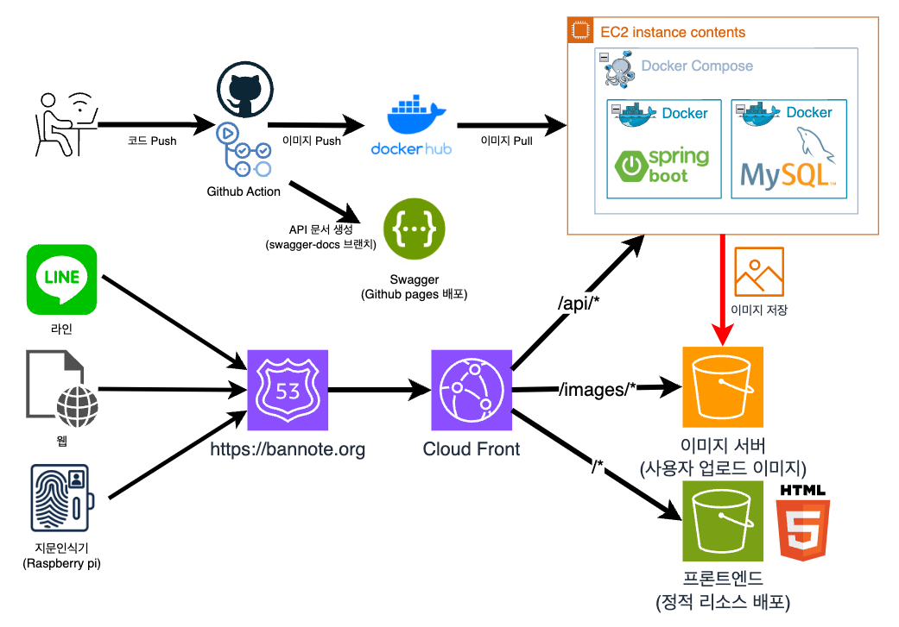

# Bannote

このプロジェクトの README は日本語と韓国語で提供いたします。
 
이 프로젝트의 README는 한국어와 일본어로 제공됩니다.

- [日本語 (Japanese)](README.md)
- [한국어 (Korean)](README_ko.md)

  

# 目次

[1. プロジェクト概要](#プロジェクト概要)

[2. プロジェクト機能](#プロジェクト機能)

[3. プロジェクト構成](#プロジェクト構成)

[4. 今後の拡張計画](#今後の拡張計画)

[5. 廃止された機能](#廃止された機能)

# プロジェクト概要

「Bannote」は、クラス（学級）のあらゆる情報を記録・管理するためのプロジェクトです。
名前の由来は、「クラスのためのノート」であると同時に、日本語の「万能（ばんのう）」という意味も込められています。

🟢 サービス URL: https://bannote.org

※ 本システムはクラス専用であり、@yju.ac.kr ドメインの学校メールアカウントでのみログイン可能です。

# プロジェクト機能

## 1. 指紋認証システム

指紋認証を通じて、学生の入退室時間を記録するシステムです。
個人別の統計情報を提供し、自身の学習パターンを確認できます。
また、ランキング機能により、他の学生との健全な競争を促します。

- 🔗 [Fingerprint Client (Raspberry)](https://github.com/Bannote/Fingerprint-client)
- 🔗 [Bannote Backend (Spring)](https://github.com/kyumin1227/Fingerprint_Backend)

## 2. 清掃管理システム

清掃管理システムでは、各エリアごとに担当学生のスケジュールをランダムに割り当てます。
過去の記録も確認可能で、担当者による管理機能も提供します。

- 🔗 [清掃スケジュールページ](https://bannote.org/src/pages/clean/clean.html)
- 🔗 [Bannote Backend (Spring)](https://github.com/kyumin1227/Fingerprint_Backend)

## 3. チャットボットおよび通知システム

LINE および KakaoTalk を通じて、指紋認証や清掃管理の通知および情報照会を行う機能です。

- 🔗 [Bannote (LINE チャットポット)](https://line.me/R/ti/p/@157fxsqo)
- 🔗 [Bannote Backend (Spring)](https://github.com/kyumin1227/Fingerprint_Backend)

# プロジェクト構成

# 今後の拡張計画

## MSA 構造への移行

現在、単一のバックエンド（Spring）で処理している指紋認証、清掃管理、通知機能をサービス単位に分離し、保守性と拡張性を向上させる予定です。

## Function Calling ベースのインテリジェントチャットボット開発

ユーザーの自然言語による質問に応じて、入退室統計、清掃履歴、ランキングなどを自動で照会し、ユーザーの言語で応答するインテリジェントチャットボットを実装予定です。

## スタディルーム予約システムの開発

クラス内のスタディルームの予約状況の確認および申請機能を追加し、スタディルームの円滑な利用をサポートする予定です。

# 廃止された機能

## 夜間自習投票および鍵管理システム（2024.05〜2024.07）

該当機能は現在廃止されています。
[🔗 関連リリースバージョンを見る](https://github.com/kyumin1227/Fingerprint_Backend/releases/tag/alpha)

## 旧フロントエンドページ（2024.05〜2024.07）

夜間自習投票および鍵管理機能の削除に伴い、共に廃止されました。
[🔗 Fingerprint Frontend](https://github.com/kyumin1227/Fingerprint_Frontend)
