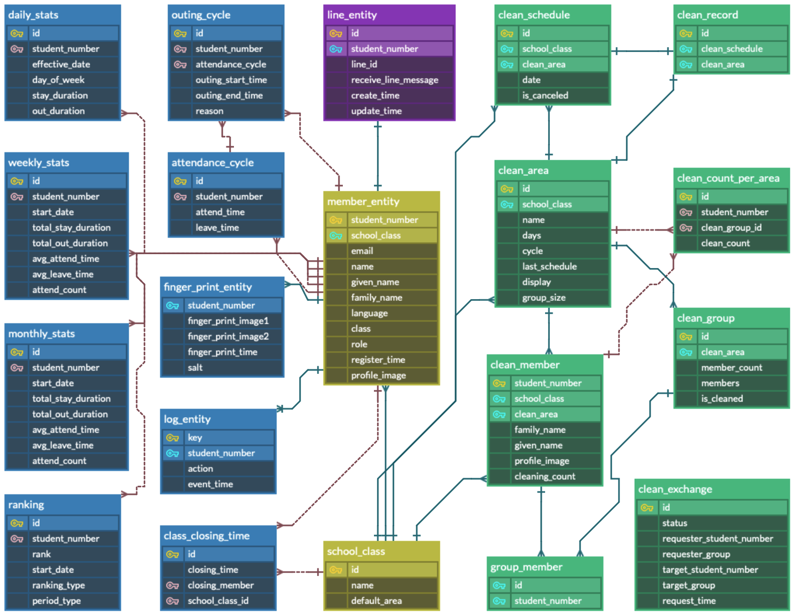

# Bannote

이 프로젝트의 README는 한국어와 일본어로 제공됩니다.
 
このプロジェクトの README は日本語と韓国語で提供いたします。

- [한국어 (Korean)](README_ko.md)
- [日本語 (Japanese)](README.md)

 

# 목차

[1. 프로젝트 개요](#프로젝트-개요)

[2. 프로젝트 기능](#프로젝트-기능)

[3. 프로젝트 구조](#프로젝트-구조)

[4. ERD](#erd)

[5. API 문서](#api-문서)

[6. 향후 확장 계획](#향후-확장-계획)

[7. 폐쇄된 기능](#폐쇄된-기능)

# 프로젝트 개요

"반노트"는 학급(반)의 모든 것을 기록하고 관리하는 프로젝트입니다.
이름처럼 반을 위한 노트이자, 일본어로 '만능(万能)'이라는 뜻도 담고 있습니다.

🟢 서비스 주소: https://bannote.org

※ 본 시스템은 학급 전용으로, `@yju.ac.kr`의 학교 이메일로만 로그인할 수 있습니다.

# 프로젝트 기능

## 1. 지문 인식

지문 인식을 통해 학생의 출입 시간을 기록하는 시스템입니다.
개인별 통계를 제공하여 자신의 학습 패턴을 확인할 수 있습니다.
또한, 랭킹 기능을 통해 다른 학생들과의 선의의 경쟁을 유도합니다.

- 🔗 [Fingerprint Client (Raspberry)](https://github.com/Bannote/Fingerprint-client)
- 🔗 [Bannote Backend (Spring)](https://github.com/kyumin1227/Fingerprint_Backend)

## 2. 청소 관리

청소 관리 시스템입니다. 각 구역별로 담당하는 학생들의 스케줄을 랜덤으로 배정합니다.
또한 이전 기록을 확인 가능하며 담당자에 의한 관리 기능 또한 제공합니다.

- 🔗 [청소 스케줄 페이지](https://bannote.org/src/pages/clean/clean.html)
- 🔗 [Bannote Backend (Spring)](https://github.com/kyumin1227/Fingerprint_Backend)

## 3. 챗봇 및 알림 시스템

라인과 카카오톡을 통해 지문 인식, 청소 관리의 알림 및 정보 조회를 수행하는 기능입니다.

- 🔗 [Bannote (LINE 챗봇)](https://line.me/R/ti/p/@157fxsqo)
- 🔗 [Bannote Backend (Spring)](https://github.com/kyumin1227/Fingerprint_Backend)

# 프로젝트 구조

# ERD

# API 문서

API 명세는 Swagger 문서로 자동 생성되며, 아래 링크에서 확인할 수 있습니다.  
본 문서는 GitHub Actions를 통해 GitHub Pages로 자동 배포되며, 항상 최신 상태로 유지됩니다.

🔗 [Swagger UI 문서 보기](https://kyumin1227.github.io/Fingerprint_Backend)

# 향후 확장 계획

## **MSA 구조로의 전환**

현재 하나의 백엔드(Spring)에서 처리 중인 지문 인식, 청소 관리, 알림 기능을 서비스 단위로 분리하여, 유지보수성과 확장성을 높일 계획입니다.

## **Function Calling 기반 지능형 챗봇 개발**

사용자의 자연어 질문에 따라 출입 통계, 청소 이력, 랭킹 등을 자동으로 조회하고 사용자의 언어로 응답할 수 있는 지능형 챗봇 구현할 예정입니다.

## **스터디룸 예약 시스템 개발**

학급 내 스터디룸의 예약 현황 조회 및 신청 기능을 추가하여 스터디룸의 원활한 사용을 지원할 예정입니다.

# 폐쇄된 기능

## 야자 투표 및 열쇠 관리 시스템 (2024.05 ~ 2024.07)

해당 기능은 현재 폐쇄되었습니다.
[관련 릴리스 버전 보기](https://github.com/kyumin1227/Fingerprint_Backend/releases/tag/alpha)

## 이전 프론트엔드 페이지 (2024.05 ~ 2024.07)

야자 투표 및 열쇠 관리 기능 삭제로 함께 폐쇄되었습니다.
[Fingerprint Frontend](https://github.com/kyumin1227/Fingerprint_Frontend)
